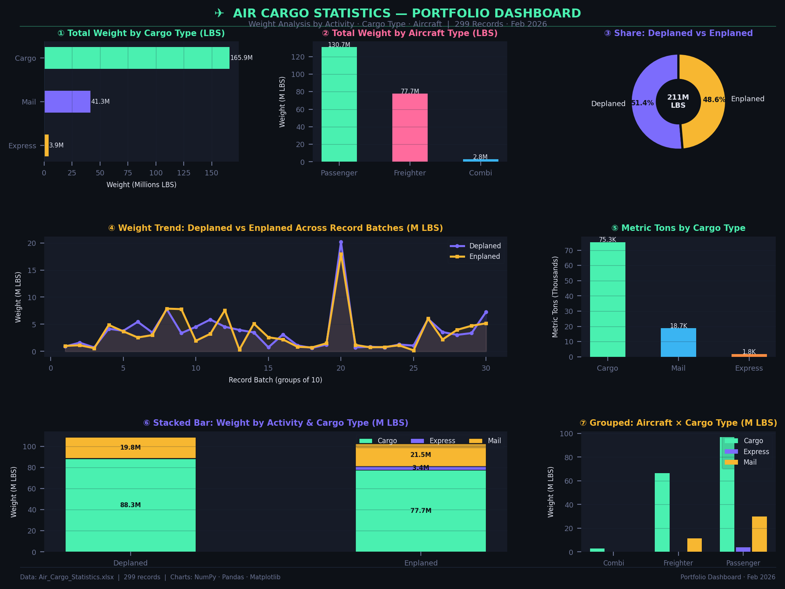

# ✈️ SFO Air Traffic Cargo Statistics — Data Analysis Project


[](Air_Cargo_Dashboard.png)

> **A full end-to-end data analysis project on San Francisco International Airport (SFO) air cargo traffic from 1999 to 2025 — covering data cleaning, exploratory analysis, and stakeholder-ready reporting.**

---

## 📌 Project Overview

This project analyzes **58,346 records** of air cargo activity at SFO spanning **26 years (1999–2025)**. The goal is to transform raw operational data into clean, decision-ready insights for stakeholders — covering cargo volumes, airline performance, geographic trends, and cargo type breakdowns.

The final deliverable is a **professional 7-sheet Excel workbook** with charts, summaries, and a full data quality audit log.

---

## 📁 Repository Structure

```
sfo-air-cargo-analysis/
│
├── data/
│   └── Air_Traffic_Cargo_Statistics.xlsx     # Raw source data
│
├── output/
│   └── SFO_Air_Cargo_Analysis.xlsx           # Final cleaned & analysed workbook
│
├── notebook/
│   └── sfo_cargo_analysis.py                 # Full analysis script
│
└── README.md
```

---

## 📊 Dataset Summary

| Attribute | Value |
|---|---|
| **Source** | San Francisco International Airport (SFO) |
| **Time Range** | July 1999 – December 2025 |
| **Total Records** | 58,346 |
| **Airlines Tracked** | 134 |
| **Geographic Regions** | 9 |
| **Cargo Types** | Cargo, Mail, Express |
| **Aircraft Types** | Passenger, Freighter, Combi |
| **Data Freshness** | As of 2026-02-20 |

### Raw Column Reference

| Column | Description |
|---|---|
| `Activity Period` | Period in YYYYMM format |
| `Activity Period Start Date` | Start date (was stored as Excel serial — fixed) |
| `Operating Airline` | Airline operating the flight |
| `Operating Airline IATA Code` | IATA code of operating airline |
| `Published Airline` | Airline on the ticket / codeshare partner |
| `Published Airline IATA Code` | IATA code of published airline |
| `GEO Summary` | Domestic or International |
| `GEO Region` | US, Asia, Europe, Canada, Mexico, etc. |
| `Activity Type Code` | Enplaned (loaded) or Deplaned (unloaded) |
| `Cargo Type Code` | Cargo / Mail / Express |
| `Cargo Aircraft Type` | Freighter / Passenger / Combi |
| `Cargo Weight LBS` | Weight in pounds |
| `Cargo Metric TONS` | Weight in metric tons |
| `data_as_of` | Dataset snapshot date |
| `data_loaded_at` | ETL load timestamp |

---

## 🧹 Data Cleaning Process

### Problems Found in the Raw Data

| # | Issue | Column(s) Affected | Action Taken |
|---|---|---|---|
| 1 | **Date columns stored as Excel serial numbers** | `Activity Period Start Date`, `data_as_of`, `data_loaded_at` | Converted using `datetime(1899,12,30) + timedelta(days=serial)` |
| 2 | **Codeshare mismatches** | `Operating Airline IATA Code` vs `Published Airline IATA Code` | Added `Is_Codeshare` boolean flag — 1,756 rows identified |
| 3 | **LBS ↔ MT conversion rounding** | `Cargo Weight LBS`, `Cargo Metric TONS` | Validated with `abs(MT - LBS/2204.62) / expected < 1%` — all 58,346 rows pass |
| 4 | **Activity Period as integer** | `Activity Period` | Cast to string; derived `Year` and `Month` columns added |
| 5 | **No Year/Month columns for time-series** | — | Derived `Year`, `Month`, `Month_Name` from start date |

### What Was Clean From the Start ✅

- **0 duplicate rows**
- **0 missing values** across all 15 columns
- **0 negative cargo weights**
- All YYYYMM period values were valid
- Max cargo value (10,801 MT) verified as a plausible large freighter record

### New Columns Added After Cleaning

| New Column | Type | Purpose |
|---|---|---|
| `Year` | Integer | Enables annual grouping |
| `Month` | Integer | Enables seasonal analysis |
| `Month_Name` | String | Human-readable month label |
| `Is_Codeshare` | Boolean | Flags codeshare flights |
| `Conversion_OK` | Boolean | Validates LBS↔MT consistency |

---

## 📈 Analysis Sections

### 1. Annual Trend Analysis

Tracks total cargo volume in Metric Tons year-over-year from 1999 to 2025, with YoY growth percentage.

**How it was built:**
```python
annual = df.groupby('Year').agg(
    Total_MT=('Cargo Metric TONS', 'sum'),
    Total_LBS=('Cargo Weight LBS', 'sum'),
    Records=('Cargo Weight LBS', 'count')
).reset_index()

annual['YoY_Growth'] = annual['Total_MT'].pct_change()
```

**Key Insight:** The sharpest cargo drop occurred in **2020** (COVID-19 impact). Volumes rebounded strongly by 2022–2023.

---

### 2. Geographic Region Analysis (GEO Breakdown)

Breaks down cargo volume by `GEO Summary` (Domestic / International) and `GEO Region` (9 regions), with market share percentages.

**How it was built:**
```python
geo = df.groupby(['GEO Summary', 'GEO Region']).agg(
    Total_MT=('Cargo Metric TONS', 'sum'),
    Records=('Cargo Weight LBS', 'count')
).reset_index().sort_values('Total_MT', ascending=False)

geo['Share'] = geo['Total_MT'] / geo['Total_MT'].sum()
```

**Key Insight:** **Asia** is the dominant international region, followed by Europe. Domestic (US) ranks #1 overall.

| Rank | Region | Type |
|---|---|---|
| 🥇 | US (Domestic) | Domestic |
| 🥈 | Asia | International |
| 🥉 | Europe | International |

---

### 3. Top Airlines Analysis

Ranks the top 15 airlines by all-time cargo volume at SFO.

**How it was built:**
```python
airlines = df.groupby('Operating Airline').agg(
    Total_MT=('Cargo Metric TONS', 'sum'),
    Records=('Cargo Weight LBS', 'count')
).reset_index().sort_values('Total_MT', ascending=False).head(15)
```

**Key Insight:** **United Airlines** is the #1 carrier by all-time tonnage, followed by Korean Air Lines and EVA Airways.

---

### 4. Cargo Type Breakdown

Analyzes cargo by type (`Cargo`, `Mail`, `Express`) and by aircraft type (`Freighter`, `Passenger`, `Combi`), plus direction (`Enplaned` vs `Deplaned`).

**How it was built:**
```python
# By type
cargo_type = df.groupby('Cargo Type Code').agg(
    Total_MT=('Cargo Metric TONS', 'sum')
).reset_index()
cargo_type['Share'] = cargo_type['Total_MT'] / cargo_type['Total_MT'].sum()

# By aircraft
aircraft = df.groupby('Cargo Aircraft Type').agg(
    Total_MT=('Cargo Metric TONS', 'sum')
).reset_index().sort_values('Total_MT', ascending=False)

# By direction
direction = df.groupby('Activity Type Code').agg(
    Total_MT=('Cargo Metric TONS', 'sum')
).reset_index()
```

**Key Insight:** `Cargo` dominates by volume. `Freighter` aircraft carry significantly more tonnage than passenger belly cargo.

---

### 5. Data Quality Log

Every check performed on the dataset is documented in a dedicated sheet, recording the finding, action taken, pass/fail status, and analyst notes. This log is included in the output workbook for full transparency and auditability.

---

## 📦 Output Workbook — 7 Sheets

| Sheet | Description |
|---|---|
| 📊 Executive Summary | KPI cards, data quality overview, and key findings |
| 🗂️ Cleaned Data | All 58,346 rows with cleaned dates, derived columns, and filters |
| 📈 Annual Trend | Year-by-year totals with YoY % growth and line chart |
| 🌍 GEO Region Analysis | Cargo by region with market share % and bar chart |
| ✈️ Top Airlines | Top 15 airlines ranked by tonnage with bar chart |
| 📦 Cargo Breakdown | Type, aircraft type, and direction analysis with pie chart |
| 🔍 Data Quality Log | Full audit trail of all cleaning checks |

---

## 🛠️ Tools & Libraries

| Tool | Purpose |
|---|---|
| `pandas` | Data loading, cleaning, grouping, and aggregation |
| `numpy` | Numerical validation and NaN handling |
| `openpyxl` | Excel workbook creation, formatting, and charting |
| `datetime` | Conversion of Excel serial date values to Python datetime |
| Python 3.10+ | Core scripting language |

---

## 🚀 How to Run

```bash
# 1. Clone the repository
git clone https://github.com/INNOCENT256-UG/sfo-air-cargo-analysis.git
cd sfo-air-cargo-analysis

# 2. Install dependencies
pip install pandas openpyxl numpy

# 3. Run the analysis
python notebook/sfo_cargo_analysis.py

# Output: output/SFO_Air_Cargo_Analysis.xlsx
```

---

## 💡 Key Findings

- 📉 **COVID-19 (2020)** caused the largest single-year cargo volume decline in the dataset's 26-year history
- 🌏 **Asia** is the #1 international cargo region at SFO by metric tonnage
- ✈️ **United Airlines** leads all carriers with the highest all-time cargo volume
- 📦 **Freighter aircraft** carry significantly more cargo than passenger or combi aircraft
- 🔀 **1,756 codeshare records** were identified and flagged for analyst awareness
- 📊 **Cargo type** (`Cargo` vs `Mail` vs `Express`) shows strong concentration in general cargo
- ✅ Dataset had **zero duplicates, zero nulls, and zero invalid weights** — rare for a raw operational dataset

---

## 👤 Author

**INNOCENT256-UG**
🔗 [github.com/INNOCENT256-UG](https://github.com/INNOCENT256-UG)

---

## 📄 License

This project is licensed under the **MIT License** — free to use, modify, and share with attribution.

---

*Built with Python · Pandas · OpenPyXL · ✈️ SFO Open Data*
